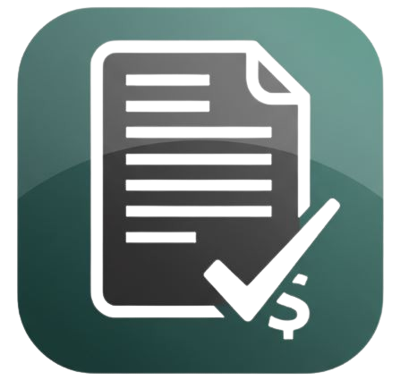

#  Invoicify

**Invoicify** is a fast, easy-to-use invoice builder that lets you create professional invoices in seconds. Completely free, secure, and privacy-focused — no data is stored. Perfect for freelancers, small businesses, or anyone who needs clean, professional invoices instantly.

---

## Features

- **Create Professional Invoices in Seconds**  
  Generate beautiful, professional invoices instantly. No sign-ups, no data storage, and ready to use in seconds.

- **Free Forever & Private**  
  100% free. Zero data storage. Your privacy is our top priority.

- **Easy-to-Use & Fast**  
  Skip the hassle — build sleek invoices quickly and efficiently.

- **Designed for Professionals**  
  Invoices are visually appealing and fully professional.

- **Focus on What Matters**  
  Invoicify handles the paperwork so you can focus on your work.

---

## Tech Stack

- **Frontend:** React
- **Styling:** Tailwind CSS
- **Authentication:** Clerk

---

## Usage

- Sign in using Clerk or continue as a guest.
- Create professional invoices in seconds.
- Download, share, or send your invoices instantly.

---

**Invoicify** — Create professional invoices quickly, privately, and for free. Even your cat will approve 🐱✨
